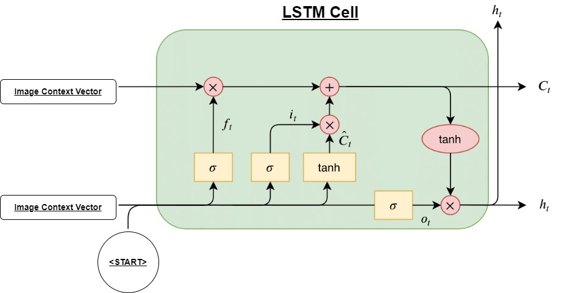
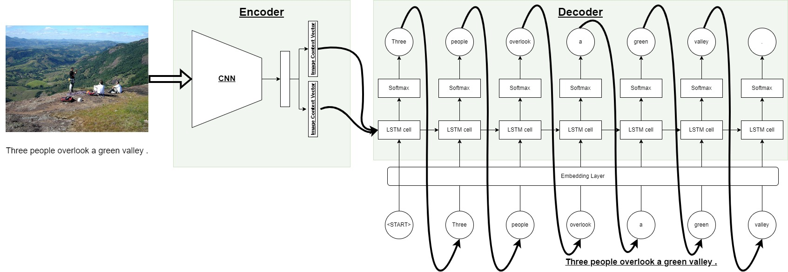

# **ImageCaptioning**

## **About this project**





This is the final assignment of the Deep Learning course of the MSc in AI.

In this project, you can train, evaluate and test an end-to-end Deep Learning Image Captioning model that consists of a CNN Encoder and an RNN Decoder.

Before you get started, make sure that you have downloaded and placed the data in the correct position. See [this section](#how-to-download-and-set-up-the-data).

- The `train.py` holds the implementation for a model's training process.
- You can run `demo.py` to launch in your browser a Gradio app that will serve the best model. There you can upload images and see the generated captions from the model.
- The `model.py` contains the models' architecture.
- The `plotter.py` and `utils.py` contain some helper functions.
- The `eda.ipynb` is a notebook for the captions' EDA.
- With the `analyse_test_set.ipynb` we can get the top K images of the test set, with the highest and lowest BLEU scores.


## **How to train a model**

1. Create a new Python environment. *Note: It is suggested to use a `Python version >= 3.9`*
2. `pip install -r requirements.txt` to install the required packages.
3. Use the `config.json` to change all the important parameters of the training process.
4. Run the `train.py` script to train, evaluate and save a model.


## **How to download and set up the data**

### **Method 1:**

You can download the dataset directly from Kaggle [here](https://www.kaggle.com/datasets/adityajn105/flickr8k).

### **Method 2:**

Use the [Kaggle API](https://github.com/Kaggle/kaggle-api):
1. `pip install kaggle`
2. `export KAGGLE_USERNAME=username`
3. `export KAGGLE_KEY=xxxxxxxxxxxxxx`
4. `kaggle datasets download adityajn105/flickr8k`
5. `unzip flickr8k.zip -d data`

---

Create a folder named `data` and place the contents of the zip file inside. The structure of your project should look like this:

```
ImageCaptioning
 ┣ data
 ┃ ┣ Images
 ┃ ┃ ┣ 1000268201_693b08cb0e.jpg
 ┃ ┃ ┣ 1001773457_577c3a7d70.jpg
 ┃ ┃ ┣ 431018958_84b2beebff.jpg
 ┃ ┃ ┣ 431282339_0aa60dd78e.jpg
 ┃ ┃ ┣ ....
 ┃ ┗ captions.txt
 ┣ final_assignment_data
 ┣ inference
 ┣ ....
 ┣ train.py
 ┗ utils.py
```